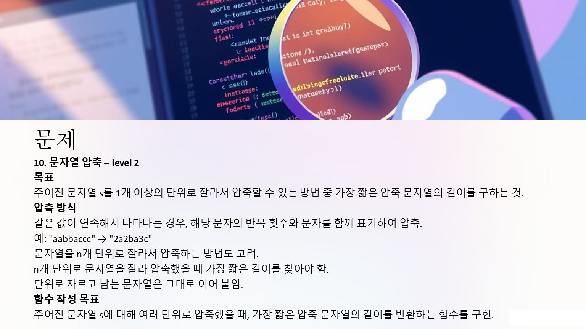
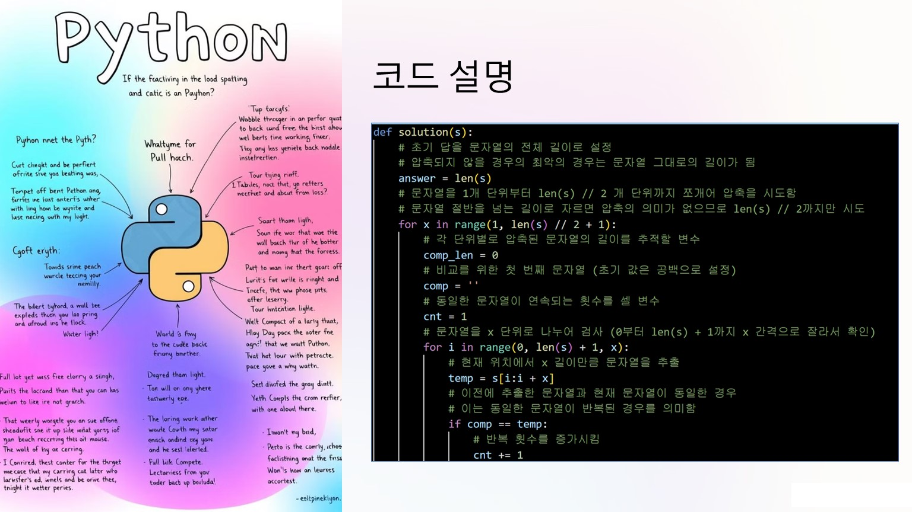
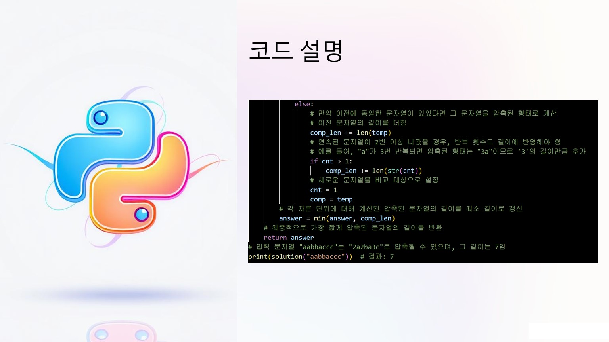

# 🧩 알고리즘 문제해결 및 풀이

## 프로그래머스 - 문자열 압축

문제를 직접 확인하고 싶으시다면 아래 버튼을 클릭하세요! 👇

---

### 📌 문제 설명

**"어피치"**는 문자열 압축 알고리즘을 공부하며, **반복되는 문자를 짧게 표현**하는 방법을 고민하고 있습니다.  
문자열을 **1개 이상의 단위로 나누어 압축**했을 때, 가장 짧은 길이를 구하는 것이 목표입니다.

예를 들어, `"aabbaccc"`는 `"2a2ba3c"`,  
`"ababcdcdababcdcd"`는 `"2ababcdcd"`로 압축할 수 있습니다.

#### 제한사항
- 문자열 길이는 **1 이상 1,000 이하**입니다.
- 문자열은 **소문자 알파벳**으로만 이루어져 있습니다.

---

### 🧪 입출력 예

| s                                    | result |
|--------------------------------------|--------|
| `"aabbaccc"`                         | `7`    |
| `"ababcdcdababcdcd"`                 | `9`    |
| `"abcabcdede"`                       | `8`    |
| `"abcabcabcabcdededededede"`         | `14`   |
| `"xababcdcdababcdcd"`                | `17`   |

---

### 📸 문제 풀이

아래는 문제를 풀이한 PPT 이미지입니다:  

