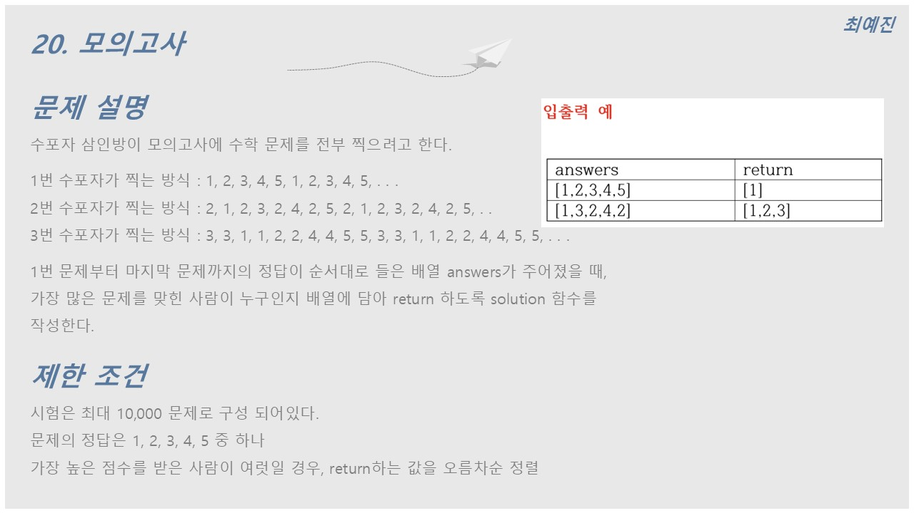
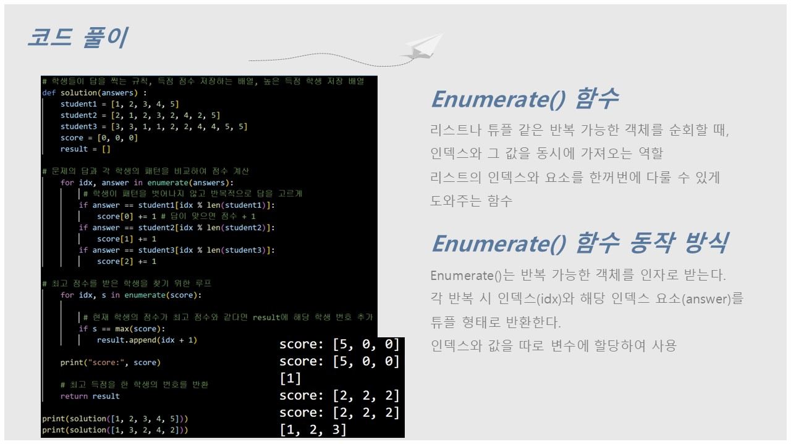

# 🧩 알고리즘 문제해결 및 풀이

## 📘 프로그래머스 문제 - 모의고사

문제의 전체 설명을 확인하고 싶으시다면 아래 버튼을 클릭해주세요! 👇

---

### 📌 문제 설명

수포자는 **수학을 포기한 사람**의 준말입니다.  
수포자 삼인방은 모의고사에 수학 문제를 전부 찍으려 합니다.  
각 수포자는 다음과 같은 방식으로 문제를 찍습니다:

- **1번 수포자**: `1, 2, 3, 4, 5, 1, 2, 3, 4, 5, ...`
- **2번 수포자**: `2, 1, 2, 3, 2, 4, 2, 5, 2, 1, 2, 3, 2, 4, 2, 5, ...`
- **3번 수포자**: `3, 3, 1, 1, 2, 2, 4, 4, 5, 5, 3, 3, 1, 1, 2, 2, 4, 4, 5, 5, ...`

1번 문제부터 마지막 문제까지의 정답이 담긴 배열 `answers`가 주어졌을 때,  
가장 많은 문제를 맞힌 사람을 배열에 담아 **오름차순 정렬**하여 return하세요.

#### ❌ 제한사항

- 시험은 최대 **10,000문제**로 구성됩니다.
- 문제의 정답은 `1, 2, 3, 4, 5` 중 하나입니다.
- 가장 높은 점수를 받은 사람이 여러 명일 경우, **오름차순 정렬**하여 return합니다.

---
### 💻 입출력 예

| answers         | result       |
|------------------|--------------|
| `[1, 2, 3, 4, 5]` | `[1]`        |
| `[1, 3, 2, 4, 2]` | `[1, 2, 3]`  |

### 📖 입출력 예 설명

#### 1️⃣

- 수포자 1은 모든 문제를 맞혔습니다.
- 수포자 2와 3은 모든 문제를 틀렸습니다.  
따라서 가장 문제를 많이 맞힌 사람은 **수포자 1**입니다.

#### 2️⃣

- 수포자 1, 2, 3 모두 2문제를 맞혔습니다.  
따라서 가장 문제를 많이 맞힌 사람은 **모든 수포자**입니다.

---

### ✏️ 문제 풀이

아래는 문제를 풀이한 PPT 이미지입니다:  

