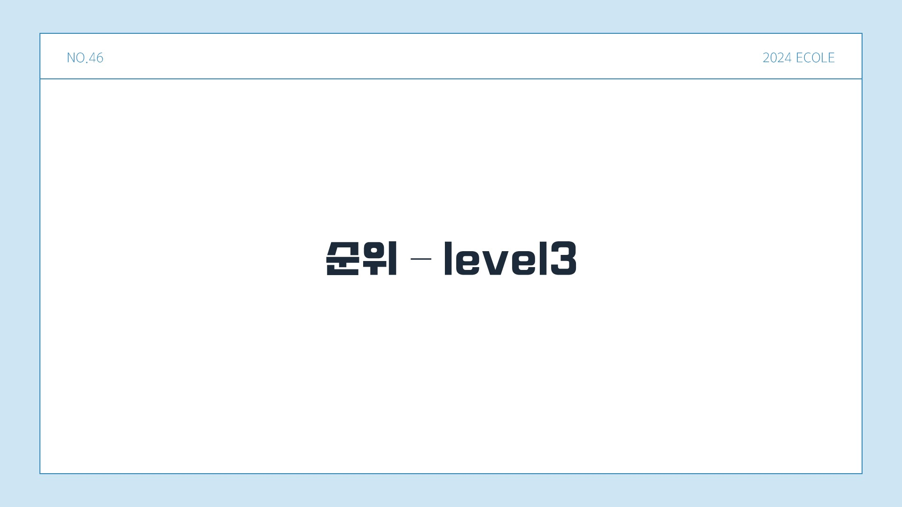
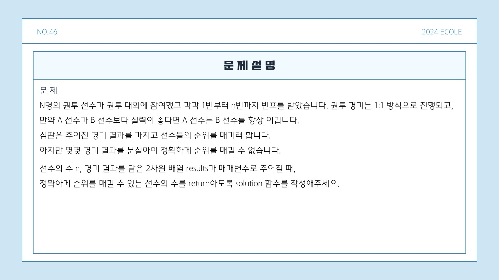
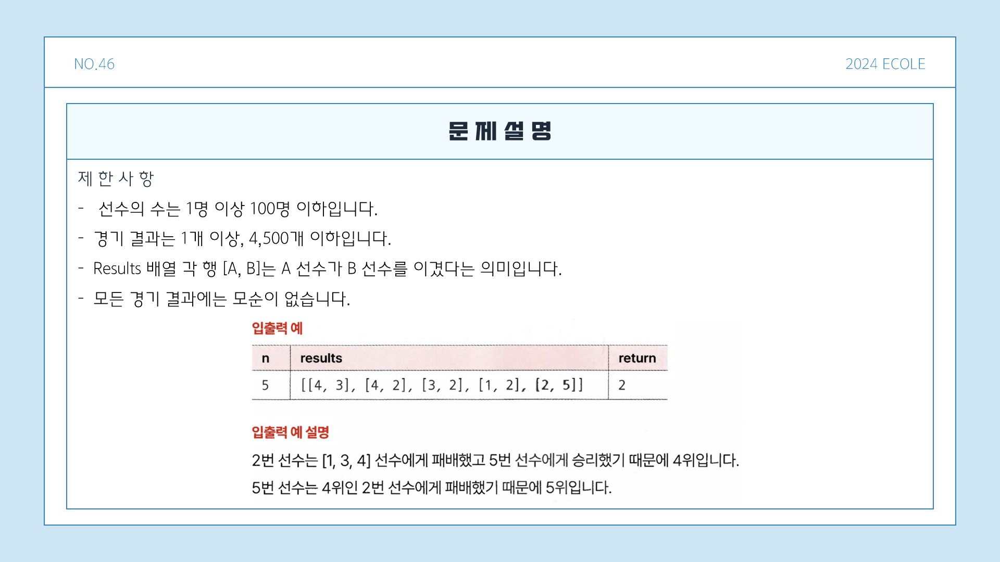
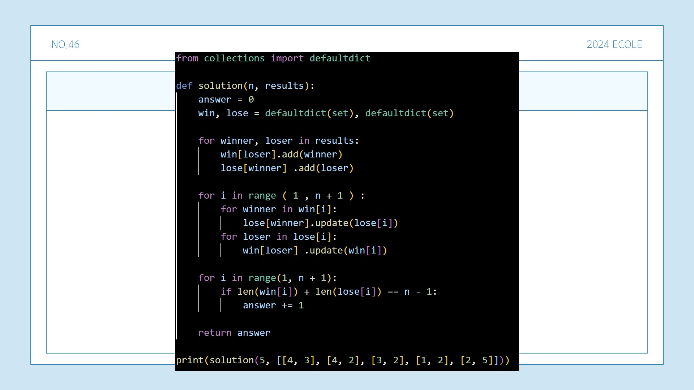
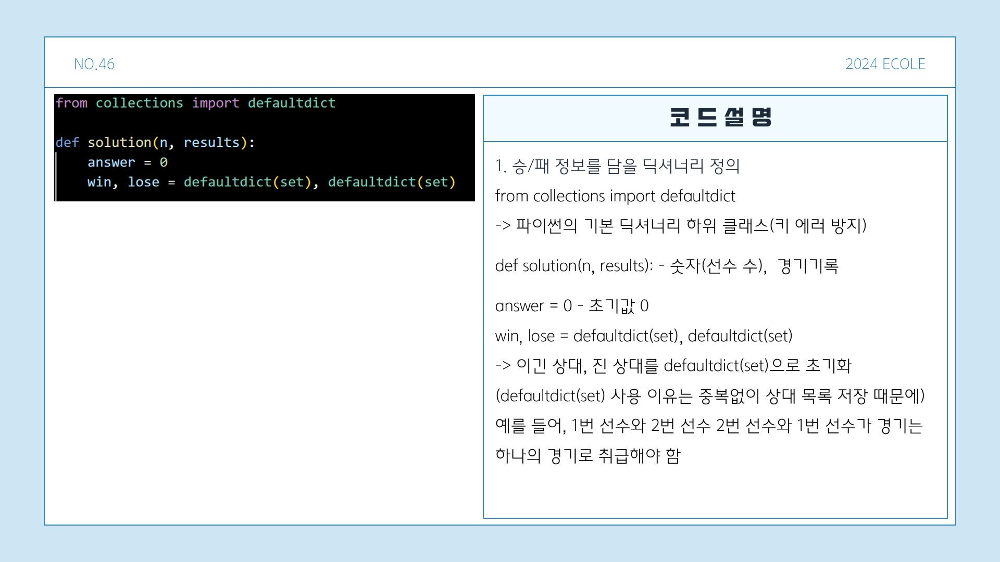
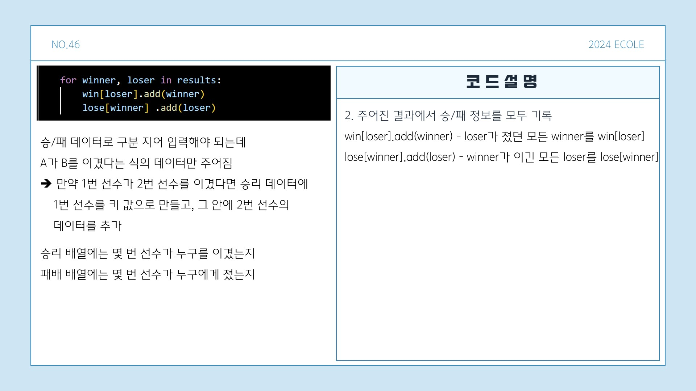
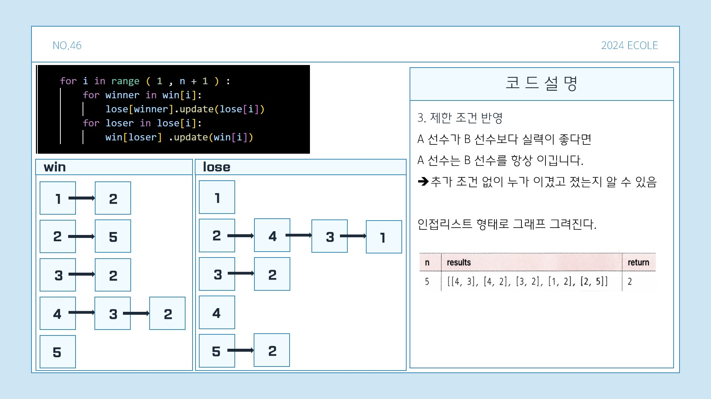
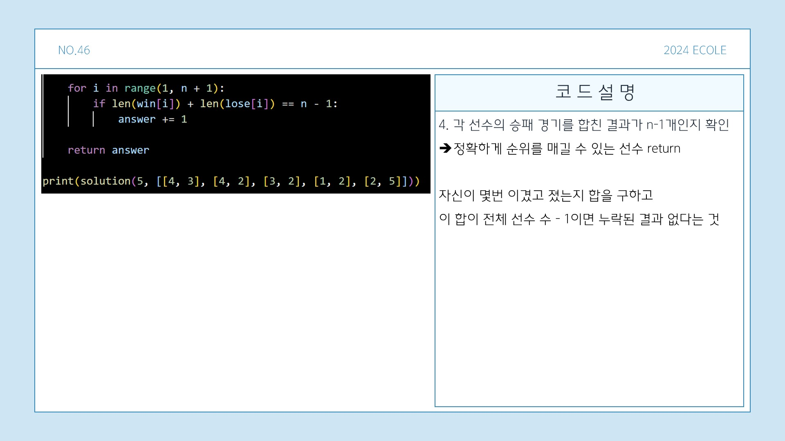

# 🧩 알고리즘 문제해결 및 풀이

## 📘 프로그래머스 문제 - 완주하지 못한 선수

문제의 전체 설명을 확인하고 싶으시다면 아래 버튼을 클릭해주세요! 👇

---
### 📌 문제 설명

n명의 권투선수가 권투 대회에 참여했고 각각 1번부터 n번까지 번호를 받았습니다. 권투 경기는 **1대1 방식으로 진행**되며,  
만약 **A 선수가 B 선수보다 실력이 좋다면 A 선수는 B 선수를 항상 이깁니다**.

심판은 주어진 경기 결과를 가지고 선수들의 순위를 매기려 하지만, **몇몇 경기 결과를 분실**하여 정확하게 순위를 매길 수 없는 경우가 있습니다.

`선수의 수 n`과 `경기 결과를 담은 2차원 배열 results`가 주어질 때, **정확하게 순위를 매길 수 있는 선수의 수**를 반환하는 함수를 작성해주세요.

#### ❌ 제한사항

- 선수의 수는 **1명 이상 100명 이하**입니다.
- 경기 결과는 **1개 이상 4,500개 이하**입니다.
- `results` 배열 각 행 `[A, B]`는 **A 선수가 B 선수를 이겼다**는 의미입니다.
- 모든 경기 결과에는 **모순이 없습니다**.

---
### 💻 입출력 예

| n   | results                                    | return |
|-----|-------------------------------------------|--------|
| 5   | `[[4, 3], [4, 2], [3, 2], [1, 2], [2, 5]]` | 2      |

### 📖 입출력 예 설명

#### 1️⃣
- **2번 선수**는 [1, 3, 4] 선수에게 패배했고 5번 선수에게 승리했기 때문에 **4위**입니다.
- **5번 선수**는 4위인 2번 선수에게 패배했기 때문에 **5위**입니다.

---

### ✏️ 문제 풀이

아래는 문제를 풀이한 PPT 이미지입니다:  

