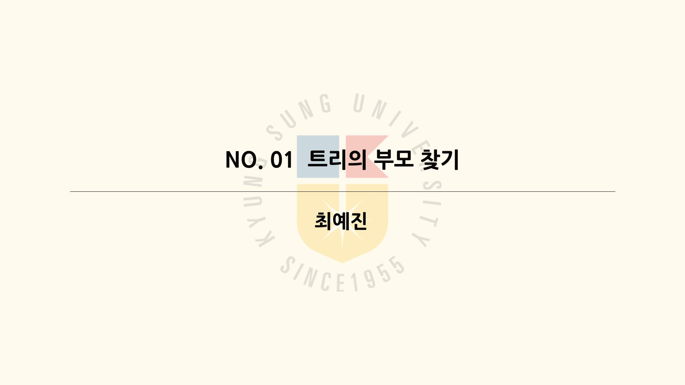
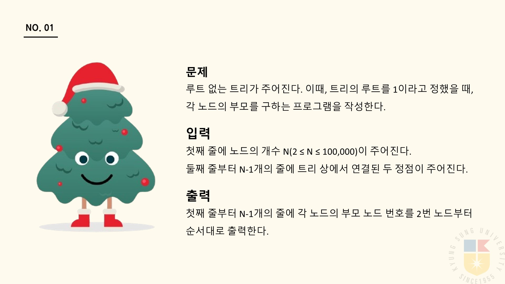
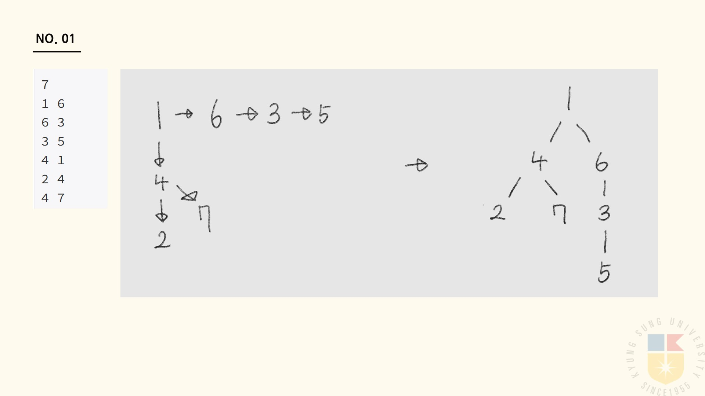
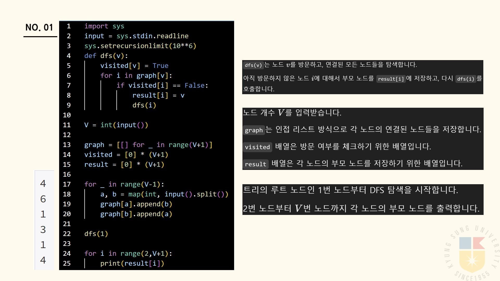
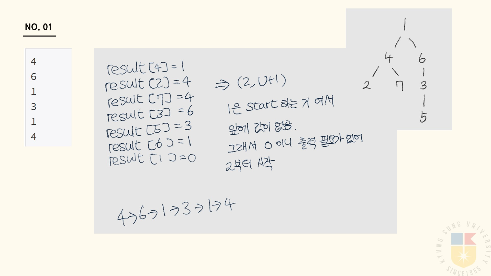

# 🧩 알고리즘 문제해결 및 풀이

## 📘 백준 문제 - 11725 트리의 부모 찾기

문제의 전체 설명을 확인하고 싶으시다면 아래 버튼을 클릭해주세요! 👇

---
### 📌 문제 설명

루트 없는 트리가 주어진다. 이때, 트리의 루트를 1이라고 정했을 때, 각 노드의 부모를 구하는 프로그램을 작성하시오.

---
### 🚀 입력

- 첫째 줄에 노드의 개수 **N (2 ≤ N ≤ 100,000)**이 주어진다.
- 둘째 줄부터 N-1개의 줄에 트리 상에서 연결된 두 정점이 주어진다.

---

### 🎯 출력

- 첫째 줄부터 N-1개의 줄에 각 노드의 부모 노드 번호를 **2번 노드부터 순서대로 출력한다**.

---
### 💻 입출력 예 

#### 1️⃣

| 예제 입력 1         | 예제 출력 1 |
|---------------------|------------|
| 7                   |            |
| 1 6                 | 4          |
| 6 3                 | 6          |
| 3 5                 | 1          |
| 4 1                 | 3          |
| 2 4                 | 1          |
| 4 7                 | 4          |

#### 2️⃣

| 예제 입력 2         | 예제 출력 2 |
|---------------------|------------|
| 12                  |            |
| 1 2                 | 1          |
| 1 3                 | 1          |
| 2 4                 | 2          |
| 3 5                 | 3          |
| 3 6                 | 3          |
| 4 7                 | 4          |
| 4 8                 | 4          |
| 5 9                 | 5          |
| 5 10                | 5          |
| 6 11                | 6          |
| 6 12                | 6          |

---

### ✏️ 문제 풀이

아래는 문제를 풀이한 PPT 이미지입니다:  

