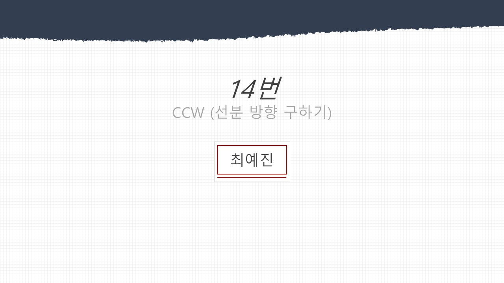
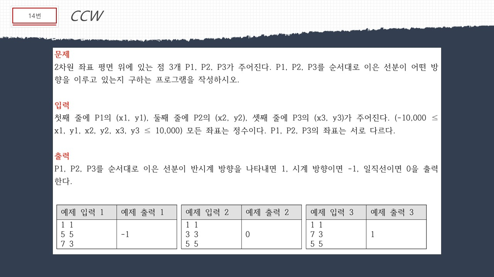
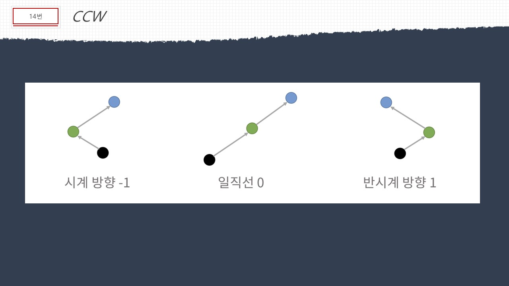
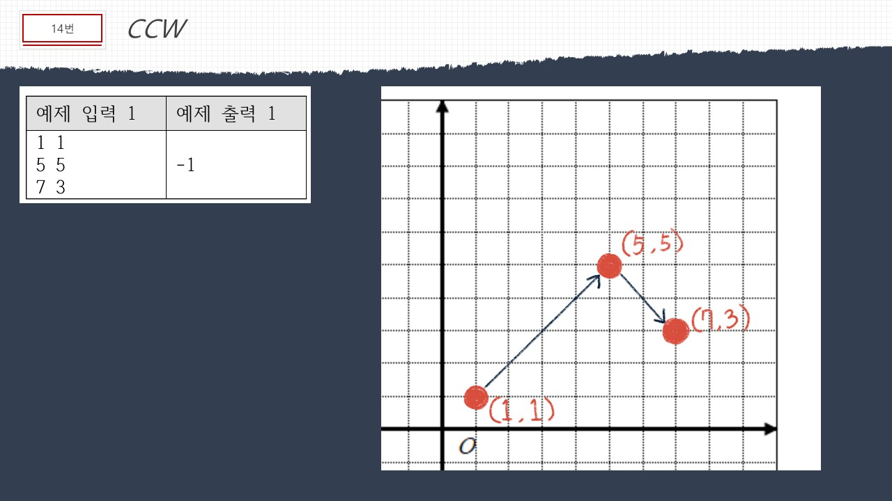
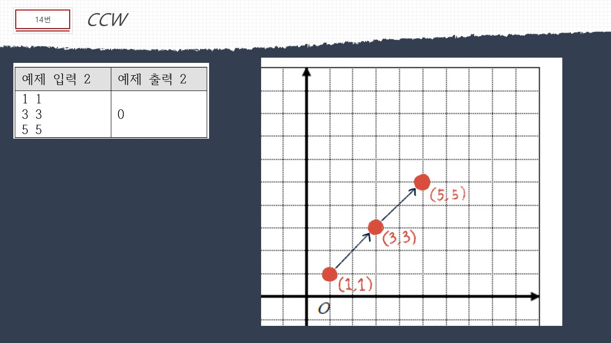
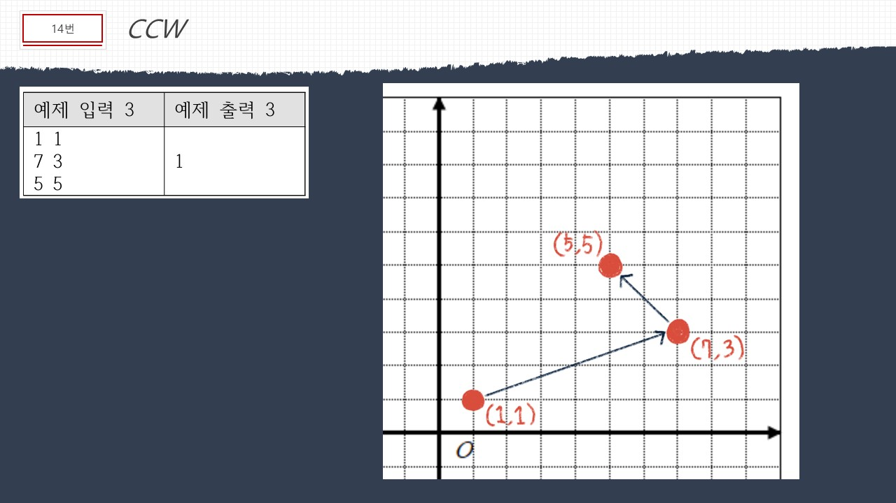
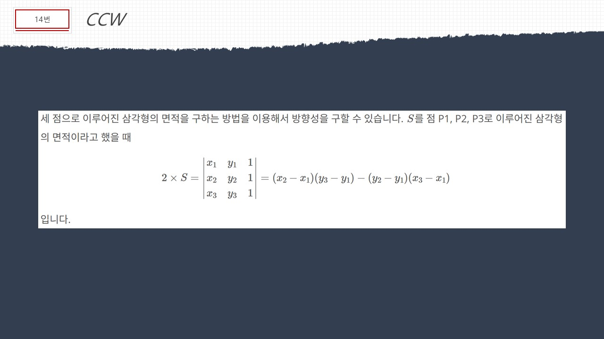
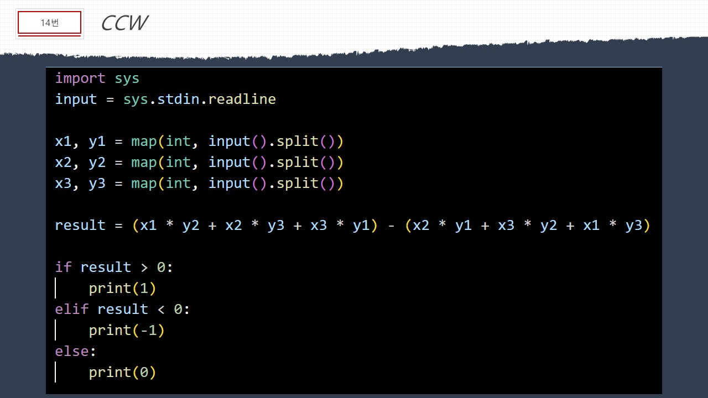

# 🧩 알고리즘 문제해결 및 풀이

## 📘 백준 문제 - 11758 CCW

문제의 전체 설명을 확인하고 싶으시다면 아래 버튼을 클릭해주세요! 👇

---
### 📌 문제 설명

2차원 좌표 평면 위에 있는 점 3개 P1, P2, P3가 주어진다. P1, P2, P3를 순서대로 이은 선분이 어떤 방향을 이루고 있는지 구하는 프로그램을 작성하시오.

---
### 🚀 입력

- 첫째 줄에 P1의 (x1, y1), 둘째 줄에 P2의 (x2, y2), 셋째 줄에 P3의 (x3, y3)가 주어진다.
- **(-10,000 ≤ x1, y1, x2, y2, x3, y3 ≤ 10,000)**  모든 좌표는 정수이다.
- P1, P2, P3의 좌표는 서로 다르다.

---

### 🎯 출력

- P1, P2, P3를 순서대로 이은 선분
  - **반시계 방향**을 나타내면 **1**을 출력한다.
  - **시계 방향**을 나타내면 **-1**을 출력한다.
  - **일직선**을 나타내면 **0**을 출력한다.

---
### 💻 입출력 예 

#### 1️⃣

| 예제 입력 1              | 예제 출력 1 |
|--------------------------|------------|
| 1 1                      | -1         |
| 5 5                      |            |
| 7 3                      |            |

#### 2️⃣

| 예제 입력 2              | 예제 출력 2 |
|--------------------------|------------|
| 1 1                      | 0          |
| 3 3                      |            |
| 5 5                      |            |

#### 3️⃣

| 예제 입력 3              | 예제 출력 3 |
|--------------------------|------------|
| 1 1                      | 1          |
| 7 3                      |            |
| 5 5                      |            |

---

### ✏️ 문제 풀이

아래는 문제를 풀이한 PPT 이미지입니다:  

